<!-- ===================== HEADER BANNER ===================== -->
<p align="center">
  
</p>

<p align="center">
  
</p>

<p align="center">
  <a href="https://www.linkedin.com/in/kaymanr"></a>
  <a href="mailto:kazi.ayman.rahman@gmail.com"></a>
  
  
</p>

<p align="center">
  
</p>

---

## 👋 Who I Am

I'm a **Mechatronics Engineering (Honours)** student at **The University of Sydney**, majoring in **Robotics & Intelligent Systems** and supported by the **Sydney International Student Award**.

I build systems where hardware meets software: register-level firmware on microcontrollers, autonomous navigation, and physics-based models that predict how real machines behave. I've also shipped real IoT deployments for clients and led student organisations of 100+ members, so I'm comfortable owning a project from requirements through to handover.

<table>
<tr>
<td width="50%" valign="top">

### ⚡ At a Glance

<table>
<tr>
<td>🤖 Robotics software with <b>ROS + TurtleBot</b></td>
<td>🪐 Rover team member at <b>SIRI</b></td>
</tr>
<tr>
<td>🔌 <b>Bare-metal C</b> across multi-board STM32 systems</td>
<td>🏠 Industry internship deploying <b>IoT smart-home systems</b></td>
</tr>
<tr>
<td>📈 Founder of a data-driven <b>e-commerce business</b></td>
<td>🎖️ President of the <b>Engineering International Student Association</b></td>
</tr>
</table>

### 📊 Results I've Delivered

| Impact | Project |
|:--|:--|
| 🌊 Engineered retrieval of a **10.4 t** capsule from **4,000 m** below sea level | Artemis II Orion recovery fixture |
| 📉 Cut resonant bridge displacement by **76.6%** | Dual-TMD vibration suppression |
| ⚡ Harvested **1.88 mW** passively from structural vibration | Dual-TMD energy harvesting |
| 🧮 Built a **7-DOF** constrained dynamics model with Baumgarte stabilisation | Dual-TMD system |
| 🔌 Fused **2 STM32s** and **5 interfaces** (SPI, I2C, UART, PWM, LiDAR capture) in bare-metal C | Escape room control system |
| 🛰️ Delivered **error-corrected telemetry** and pathfinding under communication latency | Autonomous planetary navigation |
| 🏠 Deployed **multi-platform IoT** smart-home systems for real clients | AmiNY Services internship |
| 📈 Ran an **AI-automated** business for **2+ years** alongside full-time study | E-commerce founder |

---

## 🔭 What I'm Working On

```yaml
current_focus:
  - project: "ROS + TurtleBot"
    role: "Robotics Software Specialist | ROS Navigation and Simulation"
    topics: [autonomous navigation, LiDAR and odometry integration, robot simulation, closed-loop motion control]
  - project: "SIRI | Sydney Interplanetary Rover Initiative"
    role: "Lander Test Module Specialist"
    topics: [test module design, hardware verification and validation, model-based systems engineering, lunar and Mars rover systems]
  - project: "University of Sydney coursework"
    units: [Mechanics of Solids, Electrical Circuits and Devices (MOSFETs and BJTs), Manufacturing Engineering, Object Oriented Design]
learning_next: [SLAM, path planning, computer vision]
```

---

## 🛠️ Tools I Use

<p align="center">
  
</p>

<p align="center">
  
  
  
  
  
  
  
</p>

| Domain | Skills |
|:--|:--|
| **Embedded** | Register-level SPI / I2C / UART, interrupts, input capture, PWM actuation, finite state machines |
| **Robotics** | ROS, TurtleBot, closed-loop motor control, differential steering, graph-based path planning |
| **Modelling** | Newtonian multi-body dynamics, Baumgarte stabilisation, numerical PDE methods, vibration analysis |
| **Mechanical** | Structural design under yield and buckling constraints, CAD in SolidWorks and Fusion 360 |
| **Manufacturing** | Laser cutting, FDM 3D printing, rapid prototyping, design for manufacture, manufacturing process selection |
| **Software** | Python GUIs and telemetry, data analysis, automation pipelines, Git workflows, object oriented design |

---

## 🚀 Featured Projects

<table>
<tr>
<td width="50%" valign="top">

### 🔐 Multi-Board Embedded Escape Room
Bare-metal C across **dual STM32s** with register-level SPI/I2C sensor fusion, interrupt-driven FSM logic, PWM servos, LiDAR input capture and UART telemetry to a **Python GUI**.

`C` `STM32` `SPI` `I2C` `UART` `Python`

</td>
<td width="50%" valign="top">

### 🌉 Dual-TMD Vibration Suppression & Energy Harvesting
**7-DOF** electromagnetic harvesting model for a bridge using constrained Newtonian dynamics. Achieved **76.6%** displacement reduction and **1.88 mW** harvest.

`MATLAB` `Dynamics` `Numerical Methods`

</td>
</tr>
<tr>
<td width="50%" valign="top">

### 🔴 Autonomous Planetary Navigation
Mars rover software with binary telemetry decoding, parity-based error correction, noise filtering, traversability checks, energy budgeting and **graph-based pathfinding** under comms latency.

`C` `Algorithms` `Telemetry`

</td>
<td width="50%" valign="top">

### 🚀 Artemis II Orion Recovery Fixture
Structural steel clamping fixture for deep-sea retrieval of a **10.4 t** capsule from **4,000 m**, sized against yield and buckling with a crane-compatible single-point attachment.

`Structural Design` `CAD`

</td>
</tr>
<tr>
<td width="50%" valign="top">

### 🛤️ Autonomous Line Tracking Robot
Optical reflectance navigation with PWM closed-loop motor control and interrupt-driven pulse counting via an **LM393** comparator for speed feedback and differential steering.

`Embedded C` `Control` `PWM`

</td>
<td width="50%" valign="top">

### ☀️ Dual-Axis Solar Tracker
LDR-based sensing with FSM control, timeout-based IDLE management and bidirectional search for optimal irradiance, plus a real-time status display.

`Embedded C` `FSM` `Sensors`

</td>
</tr>
</table>

---

## 💼 Experience & Leadership

| Role | Organisation | Period |
|:--|:--|:--|
| 🔧 **Engineering Intern** | AmiNY Services, Singapore | Nov 2025 to Mar 2026 |
| 📦 **Founder & Operator** | E-commerce Business, Singapore | Dec 2023 to Present |
| 🪐 **Lander Test Module Specialist** | SIRI, Sydney Interplanetary Rover Initiative | Current |
| 💰 **Treasurer** | MoanaSoc | Aug 2026 to Present |
| 🎖️ **President** | Engineering International Student Association | Oct 2025 to Feb 2026 |
| 🤝 **Vice Internal President** | Sydney University Bangladesh Students Association | Apr 2025 to Jun 2026 |
| 🌏 **International Student Officer** | SUEUA | Mar 2025 to Apr 2026 |

<p>
  
  
  
  
</p>

---

## 📈 GitHub Activity

<p align="center">
  
  
</p>

<p align="center">
  
</p>

<p align="center">
  
</p>

---

## 📫 How to Reach Me

<p align="center">
  <b>Open to internships and graduate roles in robotics, embedded systems and autonomous systems.</b><br/>
  The fastest way to reach me is LinkedIn or email.
</p>

<p align="center">
  <a href="https://www.linkedin.com/in/kaymanr"></a>
  <a href="mailto:kazi.ayman.rahman@gmail.com"></a>
</p>

<p align="center">
  
</p>
